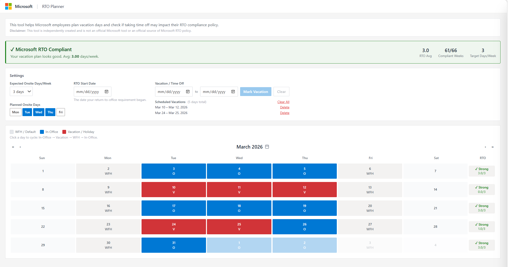
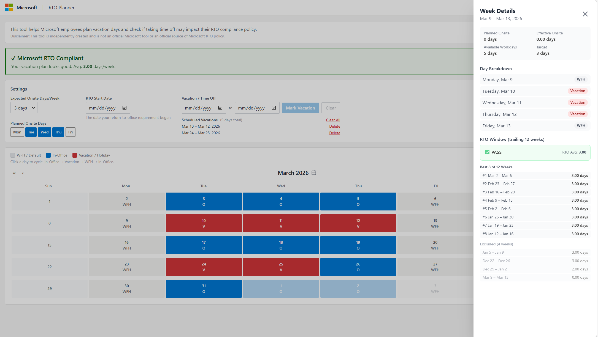

# Microsoft Vacation Planner for RTO Compliance

*This is a personal tool to help Microsoft employees plan their vacation while staying compliant with Return-to-Office requirements.*

## Preview





## Disclaimer

This tool is **not an official Microsoft tool** or policy source. It is independently created and relies solely on publicly available data.

## Why I Built This

Microsoft's RTO policy uses a rolling 12-week compliance model (best 8 of 12 weeks) that can be difficult to interpret. It's not easy to tell at a glance whether planned vacation time could put you out of compliance, and there's no easy way to visualize where you stand or plan ahead.

I built this so any Microsoft employee can:
- Instantly see their current compliance status
- Understand how vacation weeks affect their rolling average
- Plan future time off without guessing

No login required. No install. Just open it and start planning.

## Features

| Feature | Description |
|---|---|
| Calendar | Interactive month view with day-by-day status toggling and drag-select for ranges |
| RTO Policy Settings | Configure expected onsite days/week and your usual in-office days |
| Vacation Picker | Mark date ranges as vacation; saved to a vacation list |
| Compliance Engine | Rolling 12-week window, best 8 of 12 weeks averaged |
| Week Chips | Per-week ✓ Strong / ✗ Weak compliance indicators on the calendar |
| Details Drawer | Click any week chip to see your rolling window and best-8 selection |
| Summary Panel | Overall PASS / FAIL / INSUFFICIENT DATA status with your average |
| Holidays | Pre-loaded Microsoft US holidays for 2026 |
| Privacy | All data stored locally in the browser, no account needed |

## How It Works

Compliance is measured using rolling 12-week windows:

1. For each week, look back at the trailing 12 weeks (including that week)
2. Sort those weeks by onsite days and pick the **best 8** (the top 8 highest-attendance weeks)
3. Average the best-8 onsite days
4. If best-8 average >= your policy threshold: **PASS**; otherwise: **FAIL**

Vacation and DTO days count as 0 onsite days and typically fall into the dropped worst-4, which is why a few vacation days usually don't tank your compliance.

## User Guide

| Step | Action | Details |
|---|---|---|
| 1 | Set your policy | Choose Expected Onsite Days/Week (e.g. 3) in Settings |
| 2 | Set your RTO Start Date | The date your office requirement began |
| 3 | Choose your planned onsite days | Click Mon/Tue/Wed/etc. to mark your usual in-office days; the calendar auto-populates |
| 4 | Review the calendar | Each day is color-coded by status |
| 5 | Toggle individual days | Click any day to cycle its status |
| 6 | Add vacations | Use the Vacation picker to mark a date range; those days turn red |
| 7 | Read the week chips | Green ✓ Strong / red ✗ Weak chips show per-week compliance |
| 8 | Click a week chip | Opens the Details Drawer showing your rolling window and best-8 selection |
| 9 | Check the Summary Panel | Overall PASS / FAIL / INSUFFICIENT DATA with your belt average |
| 10 | Plan ahead | Navigate future months to see projected compliance before booking time off |

### Color Legend

| Color | Meaning |
|---|---|
| ⬜ Gray | Work From Home |
| 🟦 Blue | In Office |
| 🟥 Red | Vacation / Holiday |

## Running Locally

```bash
npm install
npm run dev       # starts the dev server at localhost:5173
```

Optionally:
```bash
npm run build     # production build
npm test          # run unit tests
```

## Tech Stack

| Technology | Purpose |
|---|---|
| React 18 | UI framework |
| TypeScript | Type safety |
| Zustand | State management with localStorage persistence |
| Tailwind CSS | Styling |
| date-fns | Date arithmetic |
| Vite | Build tool & dev server |
| Vitest | Unit testing |

## Test Scenarios

All 13 engine test scenarios from `src/engine/__tests__/computeBeltWindows.test.ts`:

| # | Scenario | Description | Result |
|---|---|---|---|
| 1 | Normal 12-week window | 4 days/week all 12 weeks | PASS (avg 4.0) |
| 2 | Vacation weeks excluded from best 8 | Weeks 1-4 at 4 days, weeks 5-6 at 0 days (DTO), weeks 7-12 at 3 days; DTO weeks land in worst-4 | PASS (avg 3.5) |
| 3 | Exactly 8 weeks of data | All 8 become best-8, worst-4 is empty | PASS (avg 3.0) |
| 4 | Fewer than 8 weeks | Uses all 5 available weeks, worst-4 is empty, window marked incomplete | N/A |
| 5 | Rolling window with 15 weeks | Weeks 1-3 at 1 day (low), weeks 4-15 at 4 days; early low weeks roll out of the window | PASS (avg 4.0) |
| 6 | All weeks below threshold | 1 day/week all 12 weeks | FAIL (avg 1.0) |
| 7 | Mixed distribution | 4 weeks x 5 days, 4 weeks x 1 day, 4 weeks x 3 days; best-8 selects the 5-day and 3-day weeks | PASS (avg 4.0) |
| 8 | Spec scenario | Weeks 1-4 at 4-5 days, weeks 5-6 DTO (0 days), weeks 7-12 at 3-4 days; DTO weeks excluded from best-8 | PASS (avg 4.0) |
| 9 | Exactly at policy threshold | 3 days/week all 12 weeks | PASS (avg 3.0) |
| 10 | Average just below threshold | 4 weeks x 3 days + 8 weeks x 2 days; best-8 avg = 2.5 | FAIL |
| 11 | `isInBest8ForWindow` flag | Zero-badge weeks flagged false, strong weeks flagged true; drives visual highlighting in the calendar | N/A |
| 12 | Empty input | Returns empty results, no crashes | N/A |
| 13 | Single week | 1 result, best-8 has 1 entry, average equals that week's days | N/A |

## Data & Privacy

- All data is stored in your browser's `localStorage`, nothing is sent to any server
- Clearing browser storage will reset your data
- Data does not sync across devices or browsers
